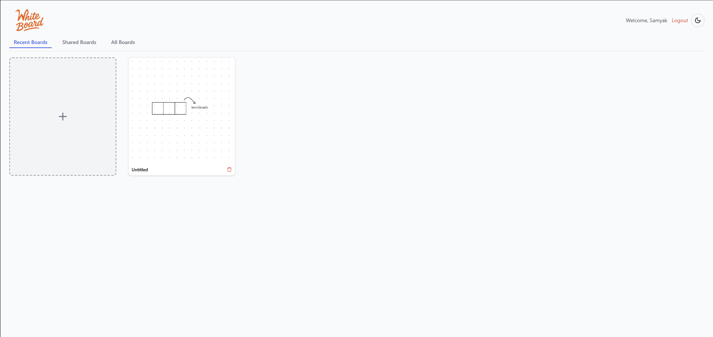

# 🖊️ Whiteboard

> A collaborative canvas app built with React where users can draw, type, and annotate on a whiteboard in real time. Supports zooming, panning, undo/redo, grid snapping, text formatting, and board sharing with role-based permissions.

[](https://whiteboard-frontend.onrender.com)  
[](#technologies)



---

## 🚩 Table of Contents

- [✨ Features](#-features)
- [📦 Technologies](#-technologies)
- [🚀 Getting Started](#-getting-started)
- [🔐 Test Login](#-test-login)
- [🛠 Deployment](#-deployment)
- [🎯 Roadmap](#-roadmap)
- [📄 License](#-license)

---

## ✨ Features

- ✏️ Drawing tools: Pen, Eraser, Line, Rectangle, Circle, Grid
- 🔤 Text with formatting: font size, bold, italic
- 🧠 Smart canvas: Zoom, Pan, Snap angles
- ♻️ Undo / Redo with Ctrl+Z / Ctrl+Y
- 💾 Auto-save (throttled) to AWS S3
- 🔒 Role-based access: View or Edit
- 📤 Share boards via email with permissions
- 🌙 Dark mode + responsive layout
- 🧭 Keyboard shortcuts for tools & actions
- 📂 Named multi-board management

---

## 📦 Technologies

| Layer       | Stack                                           |
|-------------|--------------------------------------------------|
| Frontend    | React, TypeScript, TailwindCSS                   |
| Canvas      | HTML5 Canvas API (with preview layer)            |
| State       | React Context API, Hooks                         |
| API         | Axios with token-based auth                     |
| Storage     | AWS S3 (via backend endpoint)                    |
| Deployment  | Render (static site)                             |

---

## 🚀 Getting Started

```bash
# Clone the repo
git clone https://github.com/RexTitanium/whiteboard-frontend.git
cd whiteboard

# Install dependencies
npm install

# Set backend base URL
echo "REACT_APP_BASE_URL=https://whiteboard-backend-67cb.onrender.com" > .env

# Start the dev server
npm start
```

---

## 🔐 Test Login

```
Email: johndoe@example.com
Password: johndoe
```

---

## 🛠 Deployment
Frontend is hosted on **Render** as a static site.

- ✅ GitHub connected

- ✅ Auto-deploy on push

- 🔗 Live URL

Backend runs on:

- 🛠 Express + MongoDB Atlas

- 🔒 JWT-based auth with cookie session

Storage:
- ☁️ AWS S3

---

## 🎯 Roadmap

- ✅ Autosave only after delay

- ✅ Role-based board sharing (view/edit)

- ✅ Undo/Redo + Keyboard shortcuts

- ✅ Zoom + Pan with redraw

- ⬜ Realtime multiplayer with WebSocket

- ⬜ Version history for boards

- ⬜ Sticky notes, emojis, and shape fill
 
---

## 📄 License
This project is open-sourced under the MIT License.

---

## 🧑‍💻 Built By

Samyak Shah – Passionate about full-stack development, graphics systems, and real-time apps.

 [LinkedIn](https://www.linkedin.com/in/samyakkshah/)